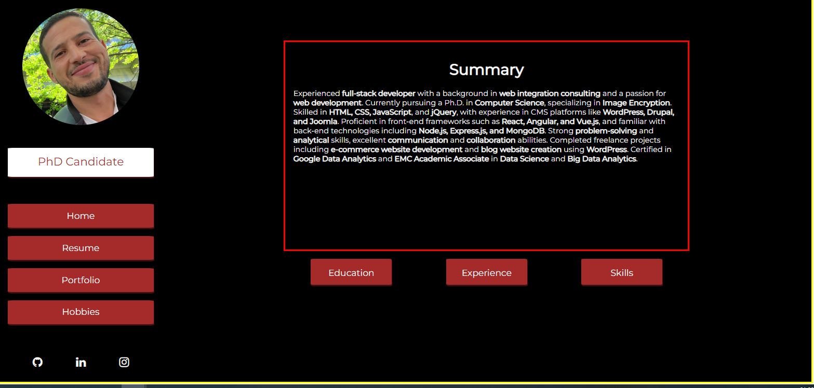
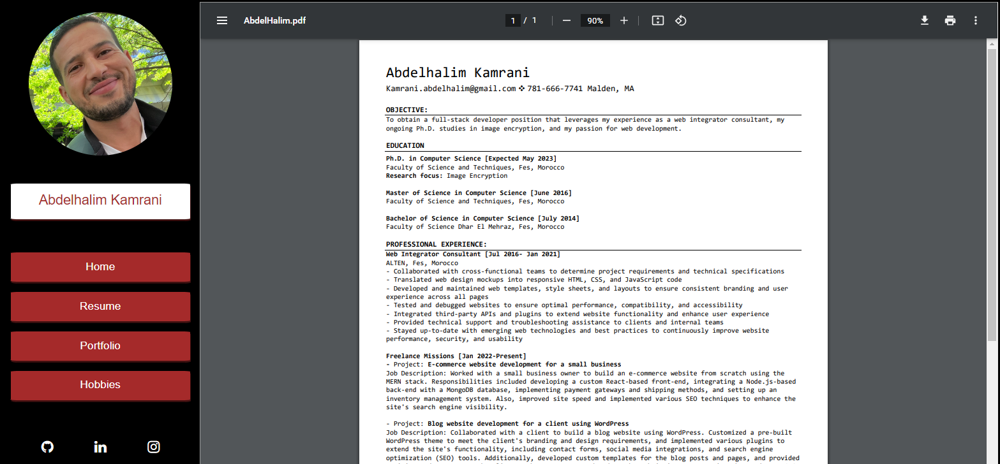
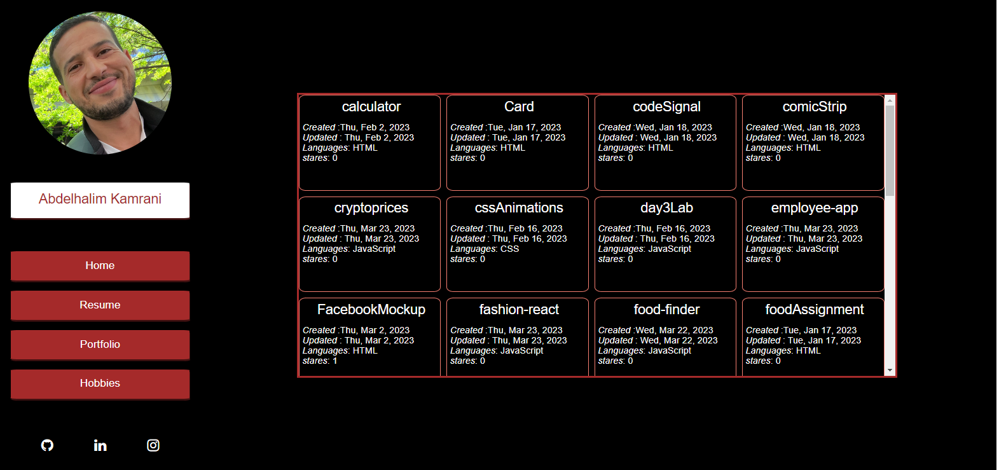
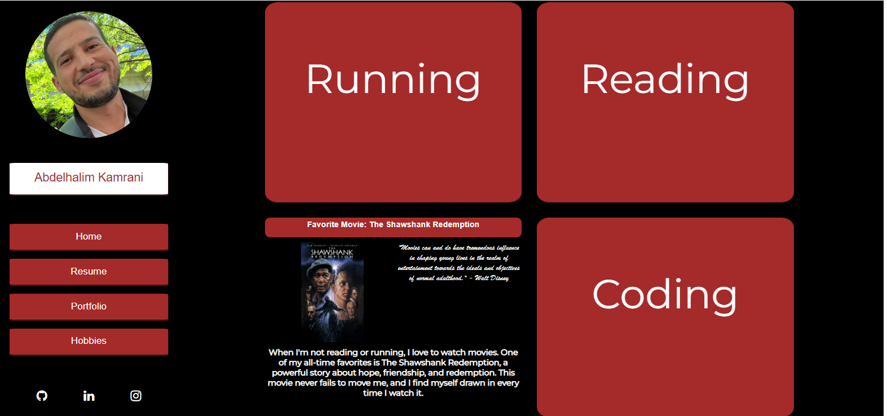

# My Portfolio

Welcome to my portfolio repository! This project showcases my skills, experience, and projects as a software engineer and Ph.D. candidate. It is built using React and features a responsive design that adapts to both mobile and desktop devices.

## Features

- **Menu:** Displays a profile picture and my name. Hovering over the name reveals my designation as a software engineer and Ph.D. candidate.
- **Main Page:** Provides a summary of my skills and experience. Buttons allow you to view details of my education, experience, and skills.
- **Education:** Shows my educational background, including degrees earned.
- **Experience:** Details my professional experience as a web integrator consultant and freelance missions.
- **Skills:** Highlights my proficiency in various technologies and showcases my research expertise in image encryption algorithms.
- **Resume:** Displays a PDF version of my full resume.
- **Portfolio:** Utilizes the GitHub API to showcase all my projects hosted on GitHub.
- **Hobbies:** Showcases four hobby cards, each providing additional information when clicked.
- **Social Media Links:** Icons that link to my LinkedIn, GitHub, and Instagram profiles.

## Deployment

The portfolio is deployed and accessible at https://github.com/abdelKamrani/React-Profile.

## Screenshots

## Getting Started

To run the portfolio locally, follow these steps:

1. Clone this repository: `git clone [repository URL]`.
2. Install dependencies: `npm install`.
3. Start the development server: `npm start`.
4. Open your browser and navigate to `http://localhost:3000`.

## Technologies Used

- React
- HTML/CSS
- JavaScript
- GitHub API

## Feedback and Contributions

I welcome any feedback, suggestions, or contributions to enhance my portfolio. Please feel free to open an issue or submit a pull request.

## Contact

You can reach out to me via LinkedIn : https://www.linkedin.com/in/abdelhalim-kamrani-08a085214/.

---

Thank you for visiting my portfolio repository. I hope you find it informative and engaging. I look forward to connecting with you and discussing future opportunities.
